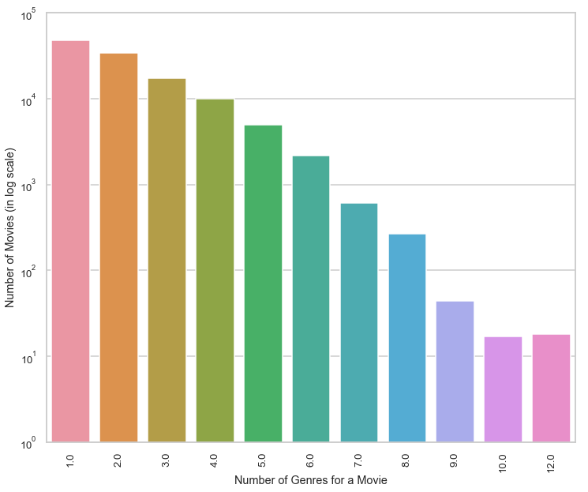
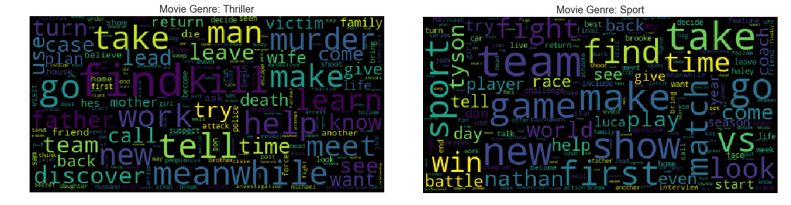
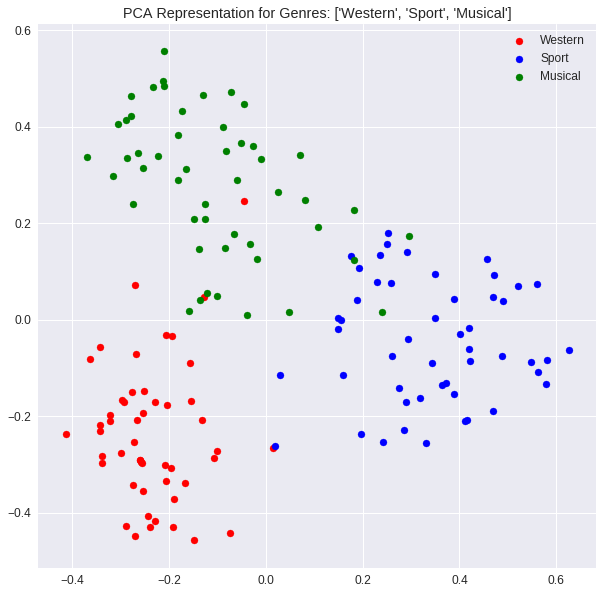

# Movie-Genre-Multi-Label-Text-Classification

For this project, I make predictions about every genre—up to 27—that a film falls into, based only on its plot. The data collection, which includes storyline and genre details for 117194 films, was sourced from IMDB. This classification issue has multiple labels. The number of genres that each movie is assigned within the data set is plotted in the image below. There are films that fit into less than 12 categories!

Data source: https://drive.google.com/drive/folders/1dxCzXB55fDNw2HpHVA8vs-qCZ--BfOul?usp=sharing

The word cloud plots for each genre provide suggestions for frequently used terms that are used to describe the plots. For instance, the vocabulary employed to characterise the storylines of various genres - `murder, kill, victim, death` for Thriller and `team, game, vs, match` for Sports (as one would expect) 

Few techniques used to classify the movies into various plots
* **Binary Relevance**: This consists of fitting one classifier per class. For each classifier, the class is fitted against all the other classes - hence n_classes classifiers are needed. The union of all classes that were predicted is taken as the multi-label output.

* **Label Powerset**: In this approach, we transform the multi-label problem to a multi-class problem with 1 multi-class classifier trained on all unique label (genre) combinations found in the training data. Each plot in the test data set is classified into one of these unique combination. Worst case, there can be 2ngenres classes 

* **Label Powerset with Clustering**: Since 2ngenres can get exponentially high with the number of genres, here we use clustering technique to reduce the number of possible classes into a manageable number. 

* **Sentence Embedding**: Using Transfer Learning techniques and Googles Universal Sentence Encoder, every plot is converted into a 512 length vector. This embedding vector is used to train models and make predictions. Below scatter plot shows the embedded vectors for `Western, Sports` and `Musical` genres where each point corresponds to a 512 length vector (representing one movie plot) which is reduced to 2-D via PCA for visualization. We can see clearly see how these 3 genres have been clustered separately indicating that the theme of the plots for these genres are significantly different

